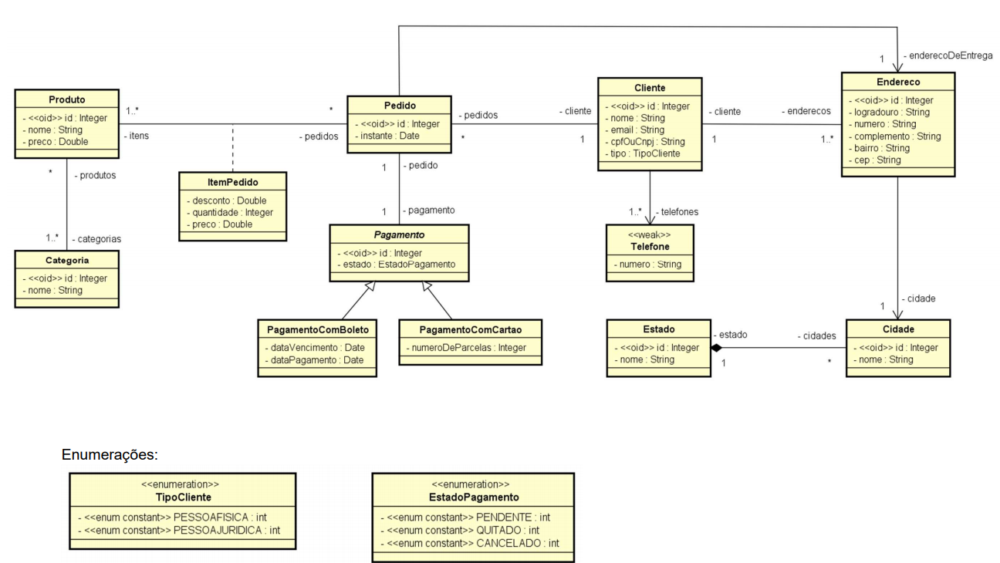
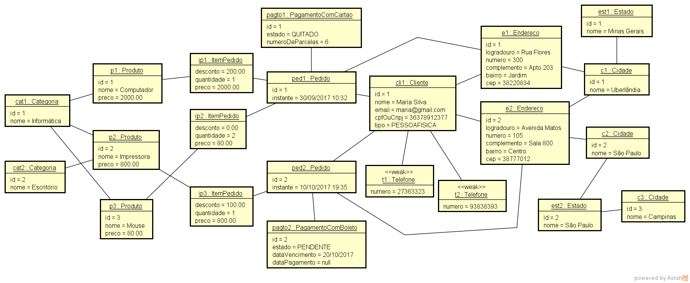
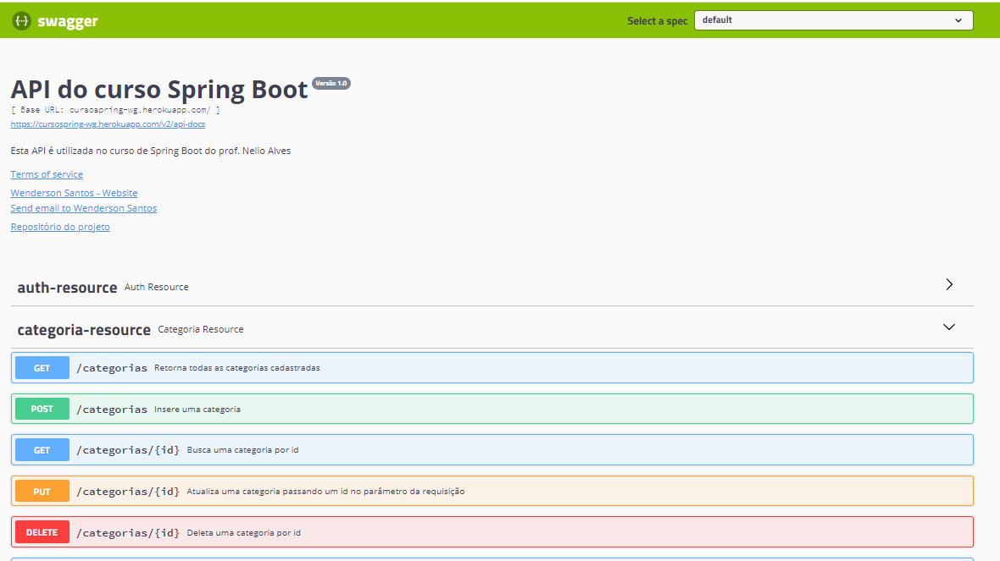

# Backend Spring
## Projeto do curso Spring Boot, Hibernate, REST, Ionic, JWT, S3, MySQL, MongoDB ofertado pelo prof Nelio Alves na Udemy
### Backend do projeto
- Endpoints da API no Swagger - [Swagger UI](https://cursospring-wg.herokuapp.com/swagger-ui.html)
- Detalhes das requisições no POSTAM - [DOCUMENTAÇÃO DA API](https://documenter.getpostman.com/view/17433262/2s83S89BeT)
#### Diagrama de classes
<p align="flex-start">
  
</p>

#### Diagrama de objetos
<p align="flex-start">
  
</p>

#### Documentaçao da API com Swagger
<p align="flex-start">
  
</p>

#### Backend construído utilizando o padrão REST (Nível de maturidade 2 sem HATEOAS - Não RestFul)
- Spring Boot, Spring Security, Spring Data Jpa
  - Hibernate, JPA, Consultas personalizadas com JPQL e validações com Bean Validation
  - Sistema de login básico com tokens JWT e autorização de endpoints específicos
  - Introdução ao ecossistema Spring, Injeção de dependências, Maven/POM.xml, IoC Container do Spring e anotações 
- Serviço de email da Google
- Operações de CRUD
  - Mapeamentos objeto-relacional do JPA, anotações do Hibernate, conceitos básicos de persistencia e funcionamento do JPA
  - Consultas com paginação e 
- Banco de dados MySQL e implantação no Heroku
- Autorização e Autenticação JWT
- Documentação da API com Swagger
-  Você pode verificar os endpoints da aplicação [aqui](https://cursospring-wg.herokuapp.com/swagger-ui.html)
 

 #### Documentaçao da API com POSTMAN

### Como utilizar os tokens no POSTMAN
1. Fazer login com o usuário padrão administrador
email admin@gmail.com
senha 123
2. Verificar o cabeçalho da resposta, no campo "Authorization" copiar o token gerado
3. Colar o token de autorização em uma requisição que necessite de tal token na sessão "Authorization" e prosseguir com a requisição

https://user-images.githubusercontent.com/77124683/192156193-b7db18e9-9953-4765-85fc-2f26d1dfd36a.mp4

#### Demonstração de como adicionar uma categoria 
**_Regra de negócio: somente um administrador pode adicionar uma categoria_**

As credênciais do administrador é adicionado manualmente no banco de dados, ao fazer login em "/login" passando no corpo da requisição os campos "email" e "senha" retornará no cabeçalho da requisição o token de acesso (Bearer)

Utilizar credênciais de adm em https://cursospring-wg.herokuapp.com/login
```
{
    "email" : "admin@gmail.com",
    "senha" : "123"
}
```
Depois adicionar o token de acesso na sessão de autorização do Postman antes de enviar a requisição. O Spring Security verifica se o token passado é do usuário autenticado

https://user-images.githubusercontent.com/77124683/192181198-c6af5c98-05eb-4d31-ac0d-6a1dca38d547.mp4

#### Documentação da api no POSTAM com possíveis retornos e descrição de endpoints

Se possível, faça o login no POSTAM WEB para testar as requisições você mesmo
[DOCUMENTAÇÃO DA API](https://documenter.getpostman.com/view/17433262/2s83S89BeT)
