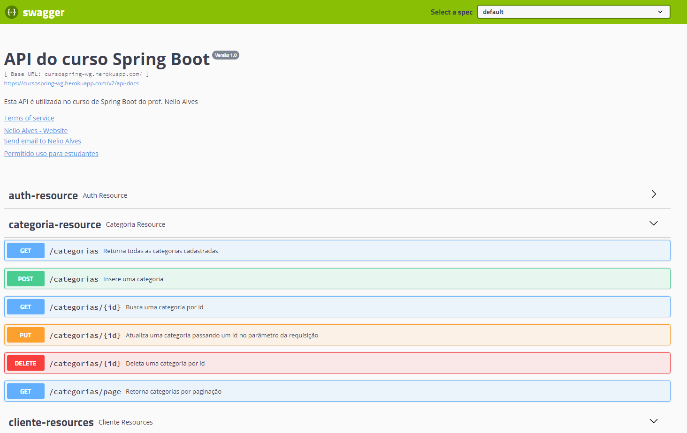

# Backend Spring
## Projeto do curso Spring Boot, Hibernate, REST, Ionic, JWT, S3, MySQL, MongoDB ofertado pelo prof Nelio Alves na Udemy
### Backend do projeto
#### Diagrama de classes

  

#### Diagrama de objetos

  

#### Documentaçao da API com Swagger

  

#### Backend construído utilizando o padrão REST (Nível de maturidade 2 sem HATEOAS - Não RestFul)
- Spring Boot, Spring Security, Spring Data Jpa
  - Hibernate, JPA, Consultas personalizadas com JPQL e validações com Bean Validation
  - Sistema de login básico com tokens JWT e autorização de endpoints específicos
  - Introdução ao ecossistema Spring, Injeção de dependências, Maven/POM.xml, IoC Container do Spring e anotações 
- Serviço de email da Google
- Operações de CRUD
  - Mapeamentos objeto-relacional do JPA, anotações do Hibernate, conceitos básicos de persistencia e funcionamento do JPA
  - Consultas com paginação e 
- Banco de dados MySQL e implantação no Heroku
- Autorização e Autenticação JWT
- Documentação da API com Swagger
-  Você pode verificar os endpoints da aplicação [aqui](https://cursospring-wg.herokuapp.com/swagger-ui.html/)
 
